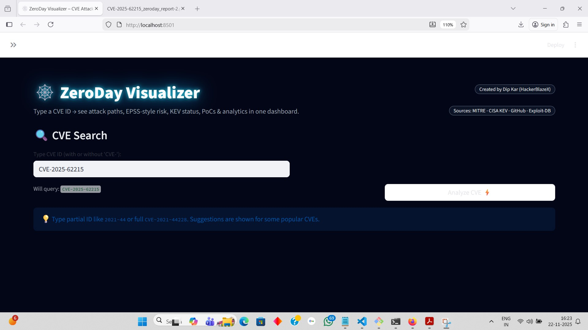

# 🕸️ ZeroDay Visualizer

**ZeroDay Visualizer** is a Streamlit-based cybersecurity dashboard that turns any **CVE ID** into a rich, interactive threat-intel view:

- 🔥 Attack flow graph (kill-chain style)
- 🚨 CVSS-based severity + smart text-based severity prediction
- ⚠️ CISA KEV status (Known Exploited or not)
- 🧪 Public PoCs from GitHub
- 📈 EPSS-style exploit probability (estimated)
- 🏢 Vendor & product intel
- 📄 One-click PDF report export

> Built for **Security Researchers, Blue Teams, Threat Hunters & SOC Analysts**.  
> Created by **Dip Kar (HackerBlazeX)**.

---

## 🌐 Live Demo

🔗 **ZeroDay Visualizer (Streamlit App)**  
https://zeroday-visualizer-tfyfz4dlxbzdksyucw5f9t.streamlit.app/

---

## ✨ Features

- 🔍 **CVE Search**
  - Accepts `CVE-YYYY-NNNN` or even `YYYY-NNNN` style input.
  - Auto-normalizes CVE IDs and shows suggestions for popular CVEs.

- 📊 **Severity & Risk**
  - Uses official **CVSS** if available from MITRE.
  - If CVSS missing → predicts severity from the CVE description (RCE, PrivEsc, XSS, etc.).
  - Calculates an **EPSS-like risk score** (0–1) with KEV awareness.

- 🧬 **Affected Products & Vendors**
  - Parses MITRE CNA data to list vendors, products & versions.
  - Tracks vendor & country trends in your session.

- 🕸️ **Attack Flow Diagram**
  - Builds a high-level attack graph using **NetworkX + Matplotlib**.
  - Category-aware paths (RCE, PrivEsc, SQLi, XSS, Path Traversal, etc.).
  - Clean dark-mode graph rendered inside Streamlit.

- 🧪 **Exploit Intelligence**
  - Pulls **GitHub PoC repos** for the CVE (sorted by stars).
  - Quick link to **Exploit-DB** CVE search.
  - Guesses vendor advisory / patch links from references.

- ⚠️ **CISA KEV Integration**
  - Loads the CISA Known Exploited Vulnerabilities JSON feed.
  - Marks whether the CVE is **known exploited in the wild**.

- 📄 **PDF Reporting**
  - Generates a structured, clean **PDF report** with:
    - CVE overview & metadata
    - Technical summary & attack category
    - High-level exploitation steps
    - Affected products (top 20)
    - Key references  
  - Text is auto-wrapped and long URLs are safely handled.

- 📈 **Session Analytics**
  - CVEs analyzed by year.
  - Vendor-wise breakdown.
  - Approx country-wise overview (based on vendor HQ).
  - Mini live threat feed from latest KEV entries.

---

## 🧱 Tech Stack

- 🐍 Python  
- 🖥️ [Streamlit](https://streamlit.io/)  
- 🌐 `requests`  
- 🧠 `networkx`  
- 📈 `matplotlib`  
- 📄 `fpdf2`  
- 📊 CISA KEV JSON feed  
- 🧾 MITRE CVE API (`https://cveawg.mitre.org/api/cve`)

---

## 🚀 Quick Start (Local)

```bash
# 1. Clone the repo
git clone https://github.com/HackerBlazeX/ZeroDay-Visualizer.git
cd ZeroDay-Visualizer

# 2. (Optional) Create & activate virtualenv
python -m venv venv
venv\Scripts\activate  # on Windows
# source venv/bin/activate  # on Linux/macOS

# 3. Install dependencies
pip install -r requirements.txt

# 4. Run the app
streamlit run zeroday_visualizer.py

## 📸 Screenshots

### 🔹 Dashboard Home UI


### 🔹 CVE Analysis Page


### 🔹 Attack Flow Visualization


### 🔹 Export to PDF + Analytics View


